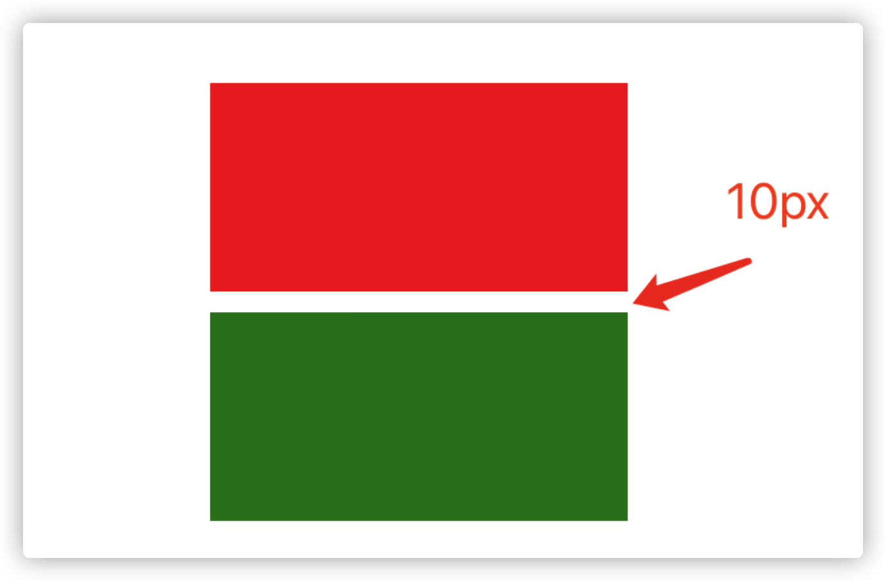
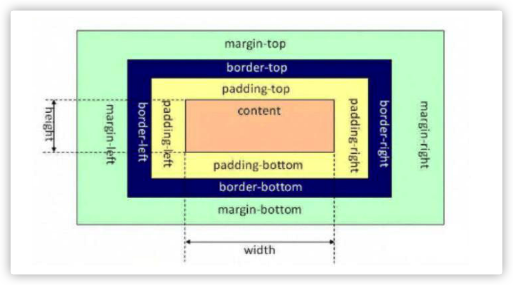

# CSS

## 1. CSS选择器的优先级是怎么样的?

**CSS选择器的优先级顺序：**

内联样式 > ID选择器 > 类选择器 > 标签选择器


## 2. 通过 CSS 的哪些方式可以实现隐藏页面上的元素?

| 方式                  | 说明                                                         |
| --------------------- | ------------------------------------------------------------ |
| opacity: 0            | 通过将元素的透明度设置为0，实现看起来隐藏的效果;但是依然会占用空间并可以进 行交互 |
| visibility: hidden    | 与透明度为0的方案非常类似，会占据空间，但不可以进行交互      |
| overflow: hidden      | 只会隐藏元素溢出的部分;占据空间且不可交互                    |
| display: none         | 可以彻底隐藏元素并从文档流中消失，不占据空间也不能交互，且不影响布局 |
| z-index: -9999        | 通过将元素的层级置于最底层，让其他元素覆盖住它，达到看起来隐藏的效果 |
| transform: scale(0,0) | 通过将元素进行缩放，缩小为0;依然会占据空间，但不可交互       |
| left: -9999px         | 通过将元素定位到屏幕外面，达到看起来看不到的效果             |


## 3. px、em、rem之间有什么区别?

| 单位 | 说明                                                         |
| ---- | ------------------------------------------------------------ |
| px   | 绝对单位。代表像素数量，页面会按照给出的精确像素进行展示     |
| em   | 相对单位。默认的基准点为父元素的字体大小，而如果自身定义了字体大小则按自身的来算。所以即 使在同一个页面内，1em可能不是一个固定的值。 |
| rem  | 相对单位。可以理解为 root em ，即基准点为根元素 <html> 的字体大小。rem是CSS3中新增单位， Chrome/FireFox/IE9+都支持, 一般用于做移动端适配 |

**以下为扩展内容，防止面试官连环问：**

正常开发 px 使用率较高, 如果要做 rem 适配, 会用到 rem 单位!

rem布局的原理:

1. 使用 rem 为单位
2. 动态的设置 html 的 font-size (媒体查询, js设置, 插件设置都可以)

`postcss` 工具：[postcss-pxtorem](https://github.com/cuth/postcss-pxtorem)  一个用于PostCSS的插件，可以从像素单位生成rem单位。

## 4. 让元素水平居中的方法有哪些?

### 1. 使用 margin

通过为元素设置左右的 margin 为 auto，实现让元素居中。

```html
<div class="center">本内容会居中</div>
```

```css
.center {
  height: 500px;
  width: 500px;
  background-color: pink;
  margin: 0 auto;
}
```

### 2. 转成行内块, 给父盒子设置 text-align: center

```html
<div class="father">
	<div class="center">我是内容盒子</div>
</div>
```

```css
.father {
  text-align: center;
}
.center {
  width: 400px;
  height: 400px;
  background-color: pink;
  display: inline-block;
}
```

### 3. 使用 flex 布局

使用 flex 提供的子元素居中排列功能，对元素进行居中。

```html
<div class="father">
	<div class="center">我是内容盒子</div>
</div>
```

```css
.father {
  display: flex;
  background-color: skyblue;
  justify-content: center;
  align-items: center;
}
.center {
  width: 400px;
  height: 400px;
  background-color: pink;
}
```

### 4. 使用定位布局

```html
<div class="father">
	<div class="center">我是内容盒子</div>
</div>
```

```css
.father {
  background-color: skyblue;
  position: relative;
  height: 500px;
}
.center {
  width: 400px;
  height: 400px;
  background-color: pink;
  position: absolute;
  left: 50%;
  top: 50%;
  transform: translate(-50%, -50%);
}
```


## 5. 在 CSS 中有哪些定位方式?

定位方式通常指：`position` 样式的几个属。

1. static 正常文档流定位

   1. 此时设置 top、right、bottom、left 以及 z-index 都无效
   2. 块级元素遵循从上往下纵向排列，行级元素遵循从左到右排列

2. relative 相对定位

   1. 这个 “相对” 是指相对于正常文档流的位置。

3. absolute 绝对定位

   1. 当前元素相对于 最近的非 static 定位的祖先元素 来确定自己的偏移位置。例如，当前为 absolute 的元素的父元素、祖父元素都为 relative，则当前元素会相对于父元素进行偏移定位。

4. fixed 固定定位

   1. 当前元素相对于屏幕视口 viewport 来确定自己的位置。并且当屏幕滚动时，当前元素的位置也不会发生改变。

5. sticky 粘性定位

   1. 这个定位方式有点像 relative 和 fixed 的结合。当它的父元素在视口区域、并进入 top 值给定的范围内时，当前元素 就以 fixed 的方式进行定位，否则就以 relative 的方式进行定位。

      ```html
      <style>
      *{
      	margin: 0; 
        padding: 0;
      }
      .header {
          width: 100%;
          height: 100px;
          background-color: orange;
      }
      .nav {
         width: 100%;
         height: 200px;
         background-color: pink;
         position: sticky;
         top: 0px;
      }
      .main {
         width: 100%;
         height: 100px;
         background-color: skyblue;
      }
      </style>
      <div class="header">我是头部</div> 
      <div class="nav">我是导航</div> 
      <div class="container">
      	<div class="main">我是主体部分1</div> 
        <div class="main">我是主体部分2</div> 
        <div class="main">我是主体部分3</div> 
        <div class="main">我是主体部分4</div> <
        div class="main">我是主体部分5</div> 
        <div class="main">我是主体部分6</div> 
        <div class="main">我是主体部分7</div> 
        <div class="main">我是主体部分8</div>
      </div>
      ```

      

## 6. 如何理解 z-index?

可以将它看做三维坐标系中的z轴方向上的图层层叠顺序。

元素默认的 z-index 为 0，可通过修改 z-index 来控制设置了postion 值的元素的图层位置。


可以将这种关系想象成一摞书本，通过 z-index 可以改变一本书在这摞书中的上下位置。

z-index 有个小坑, 如果父辈元素有定位, 且配置了z-index, 优先按照父辈元素的定位的z-index进行比较层级

```html
<style>
.father {
   width: 100%;
   height: 200px;
   position: relative;
   background-color: skyblue;
   z-index: 1;
}
.son {
   position: absolute;
   width: 100px;
   height: 100px;
   background-color: red;
   left: 0;
	 top: 0;
   z-index: 999;
  }
.box2 {
   position: absolute;
   width: 100px;
   height: 100px;
   background-color: blue;
   left: 0;
   top: 0;
   z-index: 100;
}
</style>

<div class="father">
  <div class="son"></div>
</div>
<div class="box2"></div>
```


## 7. 如何清除浮动 ?

可以有以下几种方式：

1. 定高法：固定高度

2. 使用一个空的div，并设置样式

   ```html
   <div style="clear:both"></div>
   ```

3. 为父元素添加 `overflow: hidden`

4. 定义一个 `clearfix` 样式类

   ```css
   .clearfix:after {
     /*设置内容为空*/
     content: "";
     /*高度为0*/
     height: 0;
     /*行高为0*/
     line-height: 0;
     /*将文本转为块级元素*/
     display: block;
     /*将元素隐藏*/
     visibility: hidden;
     /*清除浮动*/
     clear: both;
   }
   .clearfix {
     /*为了兼容IE*/
     zoom: 1;
   }
   ```

**补充说明**：当前 flex 已成为主流布局方式，适应性强, 且稳定, 所以浮动使用率目前已逐步降低。


## 8. 谈谈你对 BFC（块格式化上下文） 的理解?

BFC 的全称是 `Block Formatting Context，块级格式化上下文`：**这是一个用于在盒模型下布局块级盒子的独立渲染区 域，将处于BFC区域内和区域外的元素进行互相隔离。**

### 何时会形成 BFC：

满足下列条件之一就可触发BFC:

1. `HTML` 根元素
2. `position` 值为 `absolute` 或 `fixed`
3. `float` 值不为 `none`
4. `overflow` 值不为 `visible`
5. `display` 值为 `inline-block` 、 `table-cell` 或  table-caption

### BFC 的应用场景：

#### 1. 防止两个相邻块级元素的上下 margin 发生重叠 (上下margin合并问题)

属于同一 BFC 的, 两个相邻块级子元素的上下 margin 会重叠，如果想让它们不重叠，可通过让这两个相邻块级子元 素分属于不同的BFC。

以下示例代码中的两个盒子的上下外边距会重合(即它们都设置了10px的外边距，我们期望它们之间的间距是 20px，但实际效果却只有 10px):

```html
<style>
.box1 {
  width: 200px;
  height: 100px;
  background-color: red;
  margin-bottom: 10px; /* 下外边距为 10px */
}
.box2 {
  width: 200px;
  height: 100px;
  background-color: green;
  margin-top: 10px; /* 上外边距为 10px */
}
</style>
<div class="box1"></div>
<div class="box2"></div>
```



下面我们让其中一个盒子触发BFC，从而达到间隔 20px 的期望效果：

```css
.box2 {
  width: 200px;
  height: 100px;
  background-color: green;
  margin-top: 10px;
  /* 通过设置 display 为 inline-block 可以触发 BFC */
  display: inline-block; 
}
```


#### 2. 清除浮动

以下示例代码中， 容器元素 box1 的高度会没有高:

```html
<style>
.box1 {
  width: 200px;
  background-color: red;
}
.box2 {
  float: left;
  background-color: green;
}
</style>
<div class="box1">
  <div class="box2">Hello,world</div>
  <div class="box2">Hello,world</div>
  <div class="box2">Hello,world</div>
</div>
```

而通过为 `box1` 添加 `BFC` 触发条件，可以让它的高度变回正常状态：

```css
.box1 {
  width: 200px;
  background-color: red;
  overflow: hidden;
}
```

#### 3. 实现自适应布局, 防止元素被浮动元素覆盖(左边固定, 右边自适应)

以下示例中，box2 会被设置了浮动的 box1 覆盖:

```html
<style>
  .box1 {
    float: left;
    width: 300px;
    background-color: red;
    height: 400px;
}
  .box2 {
    background-color: blue;
    height: 600px;
}
</style>
<div class="box1"></div>
<div class="box2"></div>
```


要避免这种覆盖行为，可以让 `box2` 触发 `BFC`, 实现布局效果, 左边固定右边自适应:

```css
.box2 {
	background-color: blue;
	height: 600px;
  /* 将 overflow 设置为非 visible 值可触发 BFC */
	overflow: hidden; 
}
```

**备注：** [MDN 块格式化上下文](https://developer.mozilla.org/zh-CN/docs/Web/Guide/CSS/Block_formatting_context)


## 9. 什么是 CSS Sprites（雪碧图）以及它的好处?

CSS Sprites，俗称雪碧图、精灵图。

这是一种CSS图片合并技术，就是将CSS中原先引用的一些较小的图片，合并成 一张稍大的图片后再引用的技术方案。

它可以减少请求多张小图片带来的网络消耗(因为发起的HTTP请求数变少 了)，并实现提前加载资源的效果。

**缺点:**

1. CSS Sprites中任意一张小图的改动，都需要重新生成大图;并且用户端需要重新下载整张大图，这就降低了浏 览器缓存的优势 
2. 随着HTTP2的逐渐普及，HTTP2的多路复用机制可以解决请求多个小图片所创建多个HTTP请求的消耗，让CSS Sprites存在的价值降低了
3. 图片如果放大, 是会失真

目前其他主流的处理图片的方案: iconfont 字体图标, svg矢量图...


## 10. 你对媒体查询的理解是什么样的?

媒体查询是自 CSS3 开始加入的一个功能。它可以进行 **响应式适配展示**。

媒体查询由两部分组成:

1. 一个可选的媒体类型(如 screen、print 等)
2. 零个或多个媒体功能限定表达式(如 max-width: 500px、orientation: landscape 等)

这两部分最终都会被解析为 true 或 false 值，然后整个媒体查询值为 true，则和该媒体查询关联的样式就生效，否则就不生效

使用示例:

```css
<style>
  /* 在css样式表的定义中直接使用媒体查询 */
  .container {
    width: 600px;
    height: 200px;
    background-color: pink;
    margin: 0 auto;
  }

  /* 在宽度小于 767 下生效 */
  @media screen and (max-width: 767px) {
    .container {
      background-color: blue;
      width: 100%;
    }
  }

  /* 在宽度为 768px 到 991px 下生效 */
  @media screen and (min-width: 768px) and (max-width: 991px) {
    .container {
      background-color: aqua;
      width: 750px;
    }
  }

  /* 在宽度为 992px 到 1199px 下生效 */
  @media screen and (min-width: 992px) and (max-width: 1199px) {
    .container {
      background-color: red;
      width: 980px;
    }
  }

  /* 在宽度大于 1200px 下生效 */
  @media screen and (min-width: 1200px) {
    .container {
      background-color: yellow;
      width: 1170px;
    }
  }

  /* 在宽度等于 1200px 下生效 */
  @media screen and (width: 1200px) {
    .container {
      background-color: skyblue;
    }
  }
</style>
```

MDN 链接：[媒体查询](https://developer.mozilla.org/zh-CN/docs/Web/CSS/Media_Queries/Using_media_queries)

## 11. 你对盒子模型的理解是什么样的?

浏览器的渲染引擎在对网页文档进行布局时，会按照 “CSS 基础盒模型” (CSS Basic Box Model)标准，将文档中的 所有元素都表示为一个个矩形的盒子，再用 CSS 去决定这些盒子的大小尺寸、显示位置、以及其他属性(如颜色、 背景、边框等)。

下图就是盒模型示意图，它由几部分组成：

1. 内容(content) 
2. 内边距(padding) 
3. 边框(border) 
4. 外边距(margin)


## 12. 标准盒模型和怪异盒模型有哪些区别?

两者的区别主要体现在元素尺寸的表示上。

### 盒模型的指定:

在CSS3中，我们可以通过设置 box-sizing 的值来决定具体使用何种盒模型:

1. `content-box` 标准盒模型 （W3C标准盒子模型 ）
2. `border-box` 怪异盒模型（ IE标准盒子模型）

### 标准盒模型（W3C标准盒子模型）:

**大多数浏览器使用**

```css
box-sizing: content-box; (默认值)
```

在标准盒模型下，元素的宽(`width`)和高(`height`)值即为盒模型中内容(content)的实际宽高值。



### 怪异盒模型（ IE标准盒子模型）

怪异模式主要表现在 `IE` 内核的浏览器。

```css
box-sizing: border-box;
```

在怪异盒模型下，元素的 width 和 height 值却不是 content 的实际宽高，而是去除 margin 后剩下的元素占用区域 的宽高，即:


## 13. 说说伪类和伪元素的区别?

### 什么是伪类?

伪类(`pseudo-class`)是以冒号 : 为前缀，可被添加到一个选择器的末尾的关键字。

它用于让样式在元素的特定状态下才被应用到实际的元素上。比如:

1. `:checked`
2. `:hover`
3. `:disabled `
4. `:first-child`

注意: 伪类, 虽然是写法比较特殊, css选择器的权重, 和类一致的

### 什么是伪元素?

```css
:before
:after
```

伪元素用于创建一些并不在 DOM 树中的元素，并为其添加样式。伪元素的语法和伪类类似，可以一个冒号或两个冒

号为前缀。

比如，可以通过 :before 、 :after 来在一个元素前、后增加一些额外的文本并为它们添加样式;

并且，虽然用户可以看到这些文本，但其实它们并不在 DOM 树中。(**注意: 伪元素是无法注册事件的, 所以不要通过js控 制伪元素**)

### 两者的区别

虽然它们在语法上是一致的，但是它们的功能区别还是非常明显的。

1. 伪类是用来匹配元素的特殊状态的 
2. 伪元素是用来匹配元素的隶属元素的，这些隶属元素可以在界面中展示，但在 DOM 中不体现

## 14. 说说 flexbox（弹性盒布局模型）,以及适用场景？

### 1. 是什么

`Flexible Box` 简称 `flex`，意为”弹性布局”，可以简便、完整、响应式地实现各种页面布局。

采用Flex布局的元素，称为`flex`容器`container`

它的所有子元素自动成为容器成员，称为`flex`项目`item`


容器中默认存在两条轴，主轴和交叉轴，呈90度关系。项目默认沿主轴排列，通过`flex-direction`来决定主轴的方向

每根轴都有起点和终点，这对于元素的对齐非常重要

### 2. 属性

关于 [flex](https://developer.mozilla.org/zh-CN/docs/Web/CSS/flex) 常用的属性，我们可以划分为容器属性和容器成员属性

容器属性有：

- [flex-direction](https://developer.mozilla.org/zh-CN/docs/Web/CSS/flex-direction)
- [flex-wrap](https://developer.mozilla.org/zh-CN/docs/Web/CSS/flex-wrap)
- [flex-flow](https://developer.mozilla.org/zh-CN/docs/Web/CSS/flex-flow)
- [justify-content](https://developer.mozilla.org/zh-CN/docs/Web/CSS/justify-content)
- [align-items](https://developer.mozilla.org/zh-CN/docs/Web/CSS/align-items)
- [align-content](https://developer.mozilla.org/zh-CN/docs/Web/CSS/align-content)

MDN 链接：https://developer.mozilla.org/zh-CN/docs/Web/CSS/flex

### 3. 应用场景

我们能够通过`flex`简单粗暴的实现元素水平垂直方向的居中，以及在两栏三栏自适应布局中通过`flex`完成。

目前在：移动端、小程序这边的开发，都建议使用`flex`进行布局


## 15. 如何实现两栏布局，右侧自适应？三栏布局中间自适应呢？

### 两栏布局

两栏布局实现效果就是将页面分割成左右宽度不等的两列，宽度较小的列设置为固定宽度，剩余宽度由另一列撑满，比如 `Ant Design` 文档，蓝色区域为**主要内容布局容器**，侧边栏为**次要内容布局容器**


它的实现思路也非常的简单：

- 使用 float 左浮左边栏
- 右边模块使用 margin-left 撑出内容块做内容展示
- 为父级元素添加BFC，防止下方元素飞到上方内容

```css
<style>
    .box{
        overflow: hidden; 添加BFC
    }
    .left {
        float: left;
        width: 200px;
        background-color: gray;
        height: 400px;
    }
    .right {
        margin-left: 210px;
        background-color: lightgray;
        height: 200px;
    }
</style>
<div class="box">
    <div class="left">左边</div>
    <div class="right">右边</div>
</div>
```

`flex` 弹性布局也可以轻松实现：

```css
<style>
    .box{
        display: flex;
    }
    .left {
        width: 100px;
    }
    .right {
        flex: 1;
    }
</style>
<div class="box">
    <div class="left">左边</div>
    <div class="right">右边</div>
</div>
```

> 注意的是：`flex`容器的一个默认属性值:`align-items: stretch;`
>
> 这个属性导致了列等高的效果。 为了让两个盒子高度自动，需要设置: `align-items: flex-start`


### 三栏布局

三栏布局按照左中右的顺序进行排列，通常中间列最宽，左右两列次之，大家最常见的就是`github`：


实现三栏布局中间自适应的布局方式有：

- 两边使用 float，中间使用 margin
- 两边使用 absolute，中间使用 margin
- 两边使用 float 和负 margin
- display: table 实现
- flex实现
- grid网格布局

**使用flex实现**：利用`flex`弹性布局，可以简单实现中间自适应

```html
<style type="text/css">
    .wrap {
        display: flex;
        justify-content: space-between;
    }

    .left,
    .right,
    .middle {
        height: 100px;
    }

    .left {
        width: 200px;
        background: coral;
    }

    .right {
        width: 120px;
        background: lightblue;
    }

    .middle {
        background: #555;
        width: 100%;
        margin: 0 20px;
    }
</style>
<div class="wrap">
    <div class="left">左侧</div>
    <div class="middle">中间</div>
    <div class="right">右侧</div>
</div>
```


## 16. 如果要做优化，CSS提高性能的方法有哪些？

`CSS` 优化是一个非常复杂的话题，面试官询问该问题时，可以略作思考之后，**用自己的语言**， 回答该问题：

CSS 优化的实现方式有很多种，主要有如下：

- 内联首屏关键CSS
- 异步加载CSS
- 资源压缩
- 合理使用选择器
- 减少使用昂贵的属性
- 不要使用@import

### 1. 内联首屏关键CSS

在打开一个页面，页面首要内容出现在屏幕的时间影响着用户的体验，而通过内联`css`关键代码能够使浏览器在下载完`html`后就能立刻渲染

而如果外部引用`css`代码，在解析`html`结构过程中遇到外部`css`文件，才会开始下载`css`代码，再渲染。

所以，`CSS`内联使用使渲染时间提前

注意：但是较大的`css`代码并不合适内联（初始拥塞窗口、没有缓存），而其余代码则采取外部引用方式


### 2. 异步加载CSS

在`CSS`文件请求、下载、解析完成之前，`CSS`会阻塞渲染，浏览器将不会渲染任何已处理的内容

前面加载内联代码后，后面的外部引用`css`则没必要阻塞浏览器渲染。这时候就可以采取异步加载的方案，主要有如下：

1. 使用`javascript`将`link`标签插到`head`标签最后

   ```js
   // 创建link标签
   const myCSS = document.createElement( "link" );
   myCSS.rel = "stylesheet";
   myCSS.href = "mystyles.css";
   // 插入到header的最后位置
   document.head.insertBefore( myCSS, document.head.childNodes[ document.head.childNodes.length - 1 ].nextSibling );
   ```

2. 设置link标签media属性为noexis，浏览器会认为当前样式表不适用当前类型，会在不阻塞页面渲染的情况下再进行下载。加载完成后，将`media`的值设为`screen`或`all`，从而让浏览器开始解析CSS

   ```html
   <link rel="stylesheet" href="mystyles.css" media="noexist" onload="this.media='all'">
   ```

3. 通过rel属性将link元素标记为alternate可选样式表，也能实现浏览器异步加载。同样别忘了加载完成之后，将rel设回stylesheet

   ```html
   <link rel="alternate stylesheet" href="mystyles.css" onload="this.rel='stylesheet'">
   ```

### 3. 资源压缩

利用`webpack`、`gulp/grunt`、`rollup`等模块化工具，将`css`代码进行压缩，使文件变小，大大降低了浏览器的加载时间

### 4. 合理使用选择器

`css`匹配的规则是从右往左开始匹配，例如`#markdown .content h3`匹配规则如下：

- 先找到h3标签元素
- 然后去除祖先不是.content的元素
- 最后去除祖先不是#markdown的元素

如果嵌套的层级更多，页面中的元素更多，那么匹配所要花费的时间代价自然更高

所以我们在编写选择器的时候，可以遵循以下规则：

- 不要嵌套使用过多复杂选择器，最好不要三层以上
- 使用id选择器就没必要再进行嵌套
- 通配符和属性选择器效率最低，避免使用

### 5. 减少使用昂贵的属性

在页面发生重绘的时候，昂贵属性如`box-shadow`/`border-radius`/`filter`/透明度/`:nth-child`等，会降低浏览器的渲染性能

### 6.  使用@import 会导致并行下载

css样式文件有两种引入方式，一种是`link`元素，另一种是`@import`

`@import`会影响浏览器的并行下载，使得页面在加载时增加额外的延迟，增添了额外的往返耗时

而且多个`@import`可能会导致下载顺序紊乱

比如一个css文件`index.css`包含了以下内容：`@import url("reset.css")`

那么浏览器就必须先把`index.css`下载、解析和执行后，才下载、解析和执行第二个文件`reset.css`


### 7. 其他

- 减少重排操作，以及减少不必要的重绘
- 了解哪些属性可以继承而来，避免对这些属性重复编写
- cssSprite，合成所有icon图片，用宽高加上backgroud-position的背景图方式显现出我们要的icon图，减少了http请求
- 把小的icon图片转成base64编码
- CSS3动画或者过渡尽量使用transform和opacity来实现动画，不要使用left和top属性


## 17. 让Chrome支持小于12px 的文字方式有哪些？区别？

常见的解决方案有：

- `zoom`
- `-webkit-transform:scale()`
- `-webkit-text-size-adjust:none`

### Zoom

`zoom` 的字面意思是“变焦”，可以改变页面上元素的尺寸，属于真实尺寸

其支持的值类型有：

- zoom:50%，表示缩小到原来的一半
- zoom:0.5，表示缩小到原来的一半

使用 `zoom` 来”支持“ 12px 以下的字体：

```html
<style type="text/css">
    .span1{
        font-size: 12px;
        display: inline-block;
        zoom: 0.8;
    }
    .span2{
        display: inline-block;
        font-size: 12px;
    }
</style>
<body>
    <span class="span1">测试10px</span>
    <span class="span2">测试12px</span>
</body>
```


###  -webkit-transform:scale()

针对`chrome`浏览器,加`webkit`前缀，用`transform:scale()`这个属性进行放缩

注意的是，使用`scale`属性只对可以定义宽高的元素生效，所以，下面代码中将`span`元素转为行内块元素

实现代码如下：

```html
<style type="text/css">
    .span1{
        font-size: 12px;
        display: inline-block;
        -webkit-transform:scale(0.8);
    }
    .span2{
        display: inline-block;
        font-size: 12px;
    }
</style>
<body>
    <span class="span1">测试10px</span>
    <span class="span2">测试12px</span>
</body>
```

### -webkit-text-size-adjust:none

> 需要注意的是，自从`chrome 27`之后，就取消了对这个属性的支持。同时，该属性只对英文、数字生效，对中文不生效

该属性用来设定文字大小是否根据设备(浏览器)来自动调整显示大小。只对英文、数字生效，对中文不生效

属性值：

- percentage：字体显示的大小；
- auto：默认，字体大小会根据设备/浏览器来自动调整；
- none:字体大小不会自动调整

```css
html { -webkit-text-size-adjust: none; }
```

