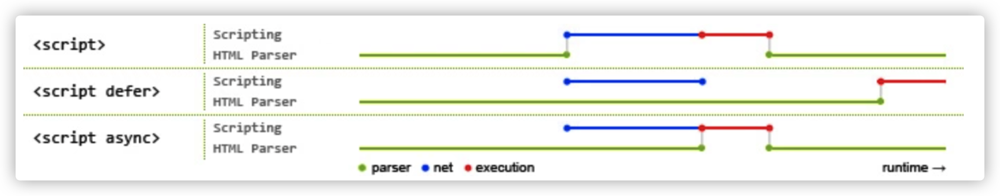

# HTML


> 面试核心思想：切勿生搬硬背，所有内容均以理解为主，面试中以自己的语言进行描述。不要求全部说出，但要求包含自己的语言。


## 1. HTML 文件中的 DOCTYPE 是什么作用?

HTML超文本标记语言: 是一个标记语言, 就有对应的语法标准
 DOCTYPE 即 Document Type，网页文件的文档类型标准。 主要作用是告诉浏览器的解析器要使用哪种 HTML规范 或 XHTML规范 来解析页面。 DOCTYPE 需要放置在 HTML 文件的 <html> 标签之前，如:

```html
<!DOCTYPE html>
<html>
...
</html> (目前主流)
```

```html
<!DOCTYPE HTML PUBLIC "-//W3C//DTD HTML 4.01//EN"
"http://www.w3.org/TR/html4/strict.dtd">
<html>
...
</html> (早期)
```


## 2. 前缀为 - 开头的元素属性是什么?

这是一种为 HTML 元素添加额外数据信息的方式，被称为 自定义属性。

我们可以直接在元素标签上声明这样的数据属性:

```html
 <div id="mydiv" data-message="Hello,world" data-num="123"></div>
```

也可以使用 JavaScript 来操作元素的数据属性:

```js
let mydiv = document.getElementById('mydiv') // 读取
console.log(mydiv.dataset.message)
// 写入
mydiv.dataset.foo = "bar!!!"
```

**注意:在各种现代前端框架出现后，这种原生的自定义属性已经变得不太常用了, 以前的使用频率非常高, 所以我们知 道即可。**

## 3. 谈谈你对 HTML 语义化的理解?

考察核心点: 语义化的好处 (利于SEO, 可阅读性更好)

**语义化之前:** 

在提倡语义化之前，你可能会使用各种各样的标签去实现同样的功能，比如:

1. 使用 span、div、p、a 等做文字, 做按钮 
2. 使用 div 做一切

从功能方面来说，这确实是不存在什么问题的，完全可以达到功能效果。但这不符合直觉，非常不友好:

1. 对人不友好：阅读代码的人不能一眼看出代码的功能
2. 对机器不友好：解析代码的程序不能很好的对这些元素进行分类处理

**语义化之后:**

为了解决上面说的问题，HTML5 规范提倡语义化标签，即使用恰当语义的 HTML 标签让⻚面具有良好的结构与含 义，比如:

1. `<p>` 标签就代表段落
2. `<article> `代表正文内容
3. `<button> `代表按钮
4. `<header> `代表头部
5. ...

**语义化的好处:**

| 对开发者的好处                                               | 对机器/程序的好处                                            |
| :----------------------------------------------------------- | :----------------------------------------------------------- |
| 使用了语义化标签的程序，可读性明显增 强，开发者可以比容易和清晰地看出网⻚ 的结构;这也更利于整个开发团队的协作 开发和后续维护工作 | 带有语义的网页代码在文字类应用上的表现力丰富，利于搜索引 擎爬虫程序来爬取和提取出有效的信息;语义化标签还支持读屏 软件，根据文章可以自动生成目录等，方便特殊人群无障碍的使 用这些网页程序。 |

**语义化的适用性:**

语义化适合内容型的网站来使用(如简书、知乎)，对其网站内容的传播有很大帮助。

## 4. HTML5 对比 HTML4 有哪些不同之处?

其他问法：html 5 新特性都有什么？

| 不同点                                  | 备注说明                                                     |
| --------------------------------------- | ------------------------------------------------------------ |
| 只有一种 DOCTYPE 文件类型声明(统一标准) | <!DOCTYPE html>                                              |
| 增加了一些新的标签元素(功能, 语义化)    | section, video, progress, nav, meter, time, aside, canvas, command, datalist, details, embed, figcaption, figure, footer, header, hgroup... |
| input 支持了几个新的类型值              | date, email, url 等等                                        |
| 新增了一些标签属性                      | charset(用于 meta 标签);async(用于 script 标签)              |
| 新增的全域属性                          | contenteditable, draggable... hidden...                      |
| 新增API                                 | 本地存储, 地理定位, Canvas绘图, 拖拽API, 即时通信 WebSocket... |

**注意：**获取地理定位: `navigator.geolocation.getCurrentPosition(successCallback, errorCallback)`  为了安全, 需要在 `https` 网站使用

## 5. meta 标签有哪些常用用法?

`<meta> ` 标签的具体功能一般由 name/http-equiv 和 content 两部分属性来定义。

1. 如果设置 name 属性，则它描述的是网页文档的信息(例如:作者、日期和时间、网⻚描述、 关键词) 
2. 如果设置 http-equiv 属性，则它描述的相当于是 HTTP 响应头信息(例如:网页内容信息, 网页缓存等)

**一些常用的功能及写法:**

1. 设置网页关键词 (SEO)：

   ```html
   <meta name="keywords" content="电商,好货,便宜">
   ```

2. 设置网页视口(viewport)控制视口的大小、缩放和比例等 (移动端开发)

   ```html
   <meta name="viewport" content="width=device-width, initial-scale=1, maximum-scale=1">
   ```

3. 设置 http 响应头:Content-Type 网页内容类型 (字符集)

   ```html
   <meta http-equiv="content-type" content="text/html;charset=utf-8">
   <!-- 设置字符集可简写为 --> 
   <meta charset="utf-8">
   ```

## 6.  img 标签的 srcset 的作用是什么?

开发者和设计师们竞相寻求 [处理响应式图片](https://developer.mozilla.org/zh-CN/docs/Learn/HTML/Multimedia_and_embedding/Responsive_images) 的方法。这的确是一个棘手的问题 ，因为我们对同一个网站在众多设备 宽度下，使用同一图像源。你不会愿意在一个大显示屏上显示模糊地、马赛克状的图像?

通过使用 img 标签的 srcset 属性，可定义一组额外的图片集合，让浏览器根据不同的屏幕状况选取合适的图片 来显示。

**也就是图片的响应式处理能力。**

如果你的响应式需求比较简单，只需要针对屏幕的不同 dpr (device pixel ratio，设备像素比)来决定图片的显示的 话，dpr 设备像素比, 越高, 能够显示的越清晰 (dpr: 2, dpr: 3)，那么就只要这么写：

```html

```

对于可变宽度的图像，我们使用 srcset 搭配 w 描述符以及 sizes 属性 。

1. `w ` 描述符告诉浏览器列表中的每个图象的宽度。
2. `sizes` 属性需要至少包含两个值，是由逗号分隔的列表。

根据最新规范，如果 `srcset` 中任何图像使用了 `w` 描述符，那么必须要设置 `sizes` 属性。

`sizes` 属性有两个值:

1. 第一个是媒体查询条件;

2. 第二个是图片对应的尺寸值，在特定媒体条件下，此值决定了图片的宽度。需要注意是，源图尺寸值不能使用百分比，如果要用100%, `vw` 是唯一可用的CSS单位。

   ```html
   
   ```

为 img 定义以上属性后，浏览器的工作流程如下:

1. 检查设备的实际宽度
2. 检查 img 标签的 sizes 属性中定义的媒体查询条件列表，并计算哪个条件最先匹配到 
3. 得到图片此时的响应式宽度
4. 加载 srcset 中最接近, 最适合媒体查询匹配到的宽度的图片

**注意: 测试时, 清除缓存测试, 因为一旦加载了高清图, 就不会也没有必要, 回过去再用小图替换了**

> 我们无法确定究竟显示哪张图像，因为每个浏览器根据我们提供的信息挑选适当图像的算法是有差异的。 (译者注:srcset和size列表是对浏览器的一个建议(hint)，而非指令。由浏览器根据其能力、网络等因素来决定。)

## 7. 在 script 标签上使用 defer 和 async 的区别是什么?

script标签存在两个属性，defer和async，因此 script标签 的使用分为三种情况:

1. ```html
   <script src="example.js"></script>
   ```

   没有defer或async属性，浏览器会立即加载并执行相应的脚本。 不等待后续加载的文档元素，读到就开始加载和执行，此举会阻塞后续文档的加载

2. ```html
   <script async src="example.js"></script>
   ```

   有了async属性，表示后续文档的加载和渲染与js脚本的加载和执行是 **异步执行** 的

3. ```html
   <script defer src="example.js"></script>
   ```

   有了defer属性，加载后续文档的过程和js脚本的加载是并行进行的(异步)，此时的js脚本仅加载不执行, js脚本的执行需要等到文档所有元素解析完成之后，DOMContentLoaded事件触发执行之前。

下图是使用了 defer、async、和未使用时的运行情况对比:



> 【上图的图例说明】 
>
> 绿线:HTML 的解析时间 
>
> 蓝线:JS 脚本的加载时间 
>
> 红色:JS 脚本的执行时间

从图中我们可以明确一下几点:

1. defer和async在网络加载过程是一致的，都是异步执行的;(放在页面顶部, 也不会阻塞页面的加载, 与页面加

   载同时进行)

2. 两者的区别, 脚本加载完成之后, async是立刻执行, defer会等一等 (等前面的defer脚本执行, 等dom的加载)

   所以, js脚本加上 async 或 defer, 放在头部可以减少网页的下载加载时间, 如果不考虑兼容性, 可以用于优化页面加载 的性能

   ```html
   <script src="https://cdn.bootcdn.net/ajax/libs/vue/2.6.12/vue.js"></script>
   <script src="https://cdn.bootcdn.net/ajax/libs/element-ui/2.15.0/index.js"></script>
   ```

