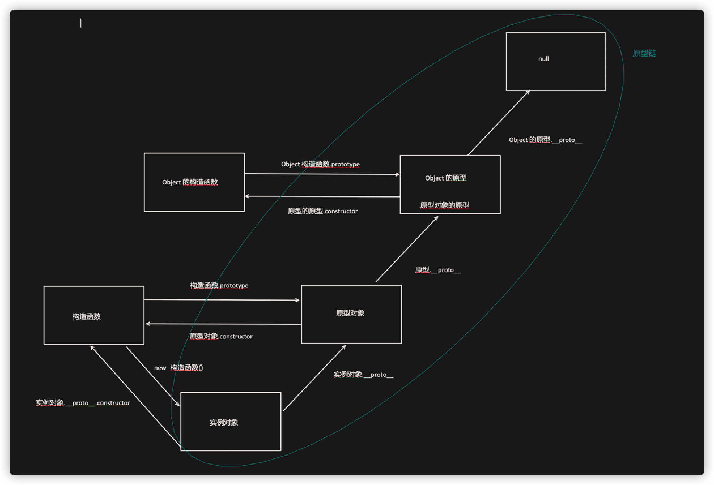
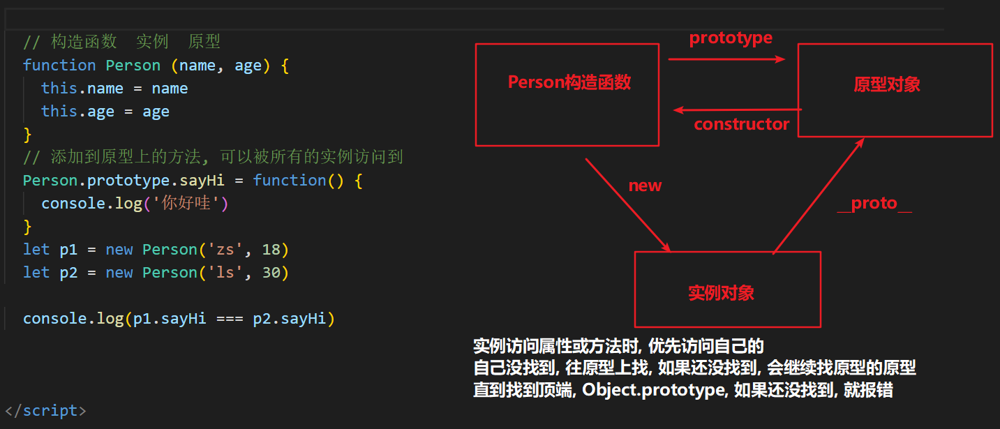

# JavaScript

## 1. 解释下什么是变量声明提升?

变量提升(hoisting)，是负责解析执行代码的 JavaScript 引擎的工作方式产生的一个特性。

JS引擎在运行一份代码的时候，会按照下面的步骤进行工作:

1.  首先，对代码进行预解析，并获取声明的所有变量
2. 然后，将这些变量的声明语句统一放到代码的最前面
3. 最后，开始一行一行运行代码

我们通过一段代码来解释这个运行过程:

```js
console.log(a)
var a = 1
function b() {
  console.log(a)
}
b() // 1
```

上面这段代码的实际执行顺序为:

1.  JS引擎将 `var a = 1` 分解为两个部分:
   1. 变量声明语句 `var a = undefined` 
   2. 变量赋值语句 `a = 1`
2.  JS引擎将 `var a = undefined` 放到代码的最前面，而 `a = 1` 保留在原地

也就是说经过了转换，代码就变成了:

```js
var a = undefined 
console.log(a) // undefined 
a=1
function b() {
  console.log(a)
}
b() // 1
```

变量的这一转换过程，就被称为变量的声明提升。

**注意：** 这种代码在 `ES6` 之后被认为是 **不规范, 不合理的。** 

我们可以使用 `let` ，避免变量提升的问题出现。


## 2. JS 的参数是以什么方式进行传递的?

基本数据类型和复杂数据类型的数据在传递时，会有不同的表现。

### 基本类型：是值传递

```js
let a = 1
function test(x) {
  // 并不会改变实参的值 console.log(x)
	x = 10 
}
test(a) // 10
console.log(a) // 1
```

### 复杂类型：传递的是地址! (变量中存的就是地址)

```js
let a = {
  count: 1
}
function test(x) {
  x.count = 10
  console.log(x)
}
test(a) // { count: 10 }
console.log(a) // { count: 10 }
```

从运行结果来看，函数内改变了参数对象内的 count 后，外部的实参对象 a 的内容也跟着改变了，所以传递的是 地址。


## 3. 什么是内存泄漏、内存溢出？

### 内存泄露

**内存泄露 memory leak**：是指程序在申请内存后，无法释放已申请的内存空间，一次内存泄露危害可以忽略，但内存泄露堆积后果很严重，无论多少内存,迟早会被占光。


### 内存溢出

**内存溢出 out of memory**：是指程序在申请内存时，没有足够的内存空间供其使用，出现 `out of memory`；

比如申请了一个`integer`,但给它存了 `long` 才能存下的数，那就是内存溢出。


## 4.  JavaScript 垃圾回收是怎么做的?

JS中内存的分配和回收都是自动完成的，内存在不使用的时候会被垃圾回收器自动回收。

正因为垃圾回收器的存在，许多人认为JS不用太关心内存管理的问题，但如果不了解JS的内存管理机制，我们同样非常容易成内存泄漏(内存无法被回收)的情况。

所以当面试官提问道 `JavaScript 垃圾回收`，我们可以从以下两个方面进行详细的解释：

1. 内存的生命周期
2. 垃圾回收算法说明
   1. 引用计数法
   2. 标记清除法

### 内存的生命周期

JS环境中分配的内存, 一般有如下生命周期：

1. 内存分配：当我们声明变量、函数、对象的时候，系统会自动为他们分配内存
2. 内存使用：即读写内存，也就是使用变量、函数等
3. 内存回收：使用完毕，由垃圾回收自动回收不再使用的内存。（全局变量一般不会回收, 一般局部变量的的值, 不用了, 会被自动回收掉）

### 垃圾回收算法说明

所谓垃圾回收, 核心思想就是：如何判断内存是否已经不再会被使用了, 如果是, 就视为垃圾, 释放掉。

在当前浏览器中，垃圾回收算法主要有两种：

1. 引用计数法（`IE` 常用，目前 `IE` 逐步退出舞台）
2. 标记清除法（大多数浏览器使用）

#### 引用计数法

IE采用的引用计数算法, 定义**“内存不再使用”**的标准很简单，就是看一个对象是否有指向它的引用。

如果没有任何变量指向它了，说明该对象已经不再需要了。

```js
// 创建一个对象person, person指向一块内存空间, 该内存空间的引用数 +1 
let person = {
	age: 22,
  name: 'ifcode'
}
// 两个变量指向一块内存空间, 该内存空间的引用数为 2
let p = person
// 原来的 person 对象被赋值为1，对象内存空间的引用数-1,
// 但因为p指向原person对象，还剩一个对于对象空间的引用, 所以对象它不会被回收
person = 1
// 原person对象已经没有引用，会被回收
p = null
```

由上面可以看出，引用计数算法是个简单有效的算法。

**但它却存在一个致命的问题：循环引用。**

如果两个对象相互引用，尽管他们已不再使用，垃圾回收器不会进行回收，导致内存泄露。

```js
function cycle() {
  let o1 = {}
  let o2 = {}
  // o1 中访问 o2
  o1.a = o2
  // o2 中访问 o1
  o2.a = o1
  // 则此时，o1 和 o2 互相引用，即：计数均为 1。
  // 但是又因为 o1 和 o2 均为局部变量， 会存在内存泄漏
} 
cycle()
```

### 标记清除算法

因为以上原因，现代的浏览器已经不再使用引用计数算法了。

现代浏览器通用的大多是基于 **标记清除算法** 的某些改进算法，总体思想都是一致的。

标记清除法：

1. 标记清除算法将“不再使用的对象”定义为“无法达到的对象”。 
2. 简单来说，就是从根部(在JS中就是全局对象)出发定时扫描内存中的对象。 
3. 凡是能从根部到达的对象，都是还需要使用的。那些无法由根部出发触及到的对象被标记为不再使用，稍后进行回收。

具体可参考：[MDN 内存管理](https://developer.mozilla.org/zh-CN/docs/Web/JavaScript/Memory_Management#%E7%AE%80%E4%BB%8B)


## 5. 谈谈你对闭包的理解？

闭包概念是面试中非常常见的一个问题，几乎可以理解为 “必答题”。

### 闭包的概念

闭包是一个 **函数**，它的概念为：**可以访问上层函数作用域中变量的函数，就是闭包函数**。

### 闭包的主要作用

在实际开发中，闭包最大的作用就是用来 **变量私有**。

查看以下例子：

```js
function fn () {
  let count = 0

  function add () {
    count++
    console.log('fn函数被调用了' + count + '次')
  }

  return add
}
const addFn = fn()
addFn()
addFn()
addFn()
```

`count` 为局部变量，不会被外部修改


## 6.  JavaScript原型，原型链 ? 有什么特点？

大图镇楼：



要讲清楚这个问题，主要着重这几个方面：

- 什么是原型对象
- 构造函数, 原型对象, 实例的三角关系图
- 原型链如何形成



### 原型对象

在 JavaScript 中，除去一部分内建函数，绝大多数的函数都会包含有一个叫做 `prototype` 的属性，指向原型对象，

基于构造函数创建出来的实例, 都可以共享访问原型对象的属性。

例如我们的 `hasOwnProperty`, `toString` ⽅法等其实是 Obejct 原型对象的方法，它可以被任何对象当做⾃⼰的⽅法来使⽤。

`hasOwnProperty` 用于判断, 某个属性, 是不是自己的  (还是原型链上的)

```js
let person = { 
  name: "Tom", 
  age: 18, 
  job: "student"
}

console.log(person.hasOwnProperty("name")) // true 
console.log(person.hasOwnProperty("hasOwnProperty")) // false 
console.log(Object.prototype.hasOwnProperty("hasOwnProperty")) // true
```

可以看到，`hasOwnProperty` 并不是 `person` 对象的属性，但是 `person` 却能调用它。

### 原型链

在 JavaScript 中，每个对象中都有一个 `__proto__` 属性，这个属性指向了当前对象的构造函数的原型。

对象可以通过自身的 `__proto__`属性与它的构造函数的原型对象连接起来，

而因为它的原型对象也有 `__proto__`，因此这样就串联形成一个链式结构，也就是我们称为的原型链。

**详情可查看：** [MDN 继承与原型链](https://developer.mozilla.org/zh-CN/docs/Web/JavaScript/Inheritance_and_the_prototype_chain)


## 7. Javascript如何实现继承？

继承（inheritance）是：面向对象软件技术当中的一个概念。可以使得子类具有父类别的各种属性和方法，而不需要再次编写相同的代码。

但是 `JavaScript` 并不是真正的面向对象语言，所以它的继承会更加复杂（相对于 `java` 而言），或者说 “更加灵活”

下面给出`JavaScripy`常见的继承方式：

- 原型链继承
- 构造函数继承（借助 call）
- 组合继承
- 原型式继承
- 寄生式继承
- 寄生组合式继承
- ES6 的 extends 继承

### 原型链继承

原型链继承是比较常见的继承方式之一，其中涉及的 **构造函数、原型和实例** 

三者之间存在着一定的关系，即：**每一个构造函数都有一个原型对象，原型对象又包含一个指向构造函数的指针，而实例则包含一个原型对象的指针**

举个例子：

```js
 function Parent() {
    this.name = 'parent1';
    this.play = [1, 2, 3]
  }
  function Child() {
    this.type = 'child2';
  }
  Child1.prototype = new Parent();
  console.log(new Child())
```

上面代码看似没问题，实际存在潜在问题：

```js
var s1 = new Child2();
var s2 = new Child2();
s1.play.push(4);
console.log(s1.play, s2.play); // [1,2,3,4]
```

改变`s1`的`play`属性，会发现`s2`也跟着发生变化了，这是因为两个实例使用的是同一个原型对象，内存空间是共享的。

### 构造函数继承

借助 `call`调用`Parent`函数

```js
function Parent(){
    this.name = 'parent1';
}

Parent.prototype.getName = function () {
    return this.name;
}

function Child(){
    Parent1.call(this);
    this.type = 'child'
}

let child = new Child();
console.log(child);  // 没问题
console.log(child.getName());  // 会报错
```

可以看到，父类原型对象中一旦存在父类之前自己定义的方法，那么子类将无法继承这些方法

相比第一种原型链继承方式，父类的引用属性不会被共享，优化了第一种继承方式的弊端，但是只能继承父类的实例属性和方法，不能继承原型属性或者方法。

### 组合继承

前面我们讲到两种继承方式，各有优缺点。组合继承则将前两种方式继承起来：

```js
function Parent3 () {
    this.name = 'parent3';
    this.play = [1, 2, 3];
}

Parent3.prototype.getName = function () {
    return this.name;
}
function Child3() {
    // 第二次调用 Parent3()
    Parent3.call(this);
    this.type = 'child3';
}

// 第一次调用 Parent3()
Child3.prototype = new Parent3();
// 手动挂上构造器，指向自己的构造函数
Child3.prototype.constructor = Child3;
var s3 = new Child3();
var s4 = new Child3();
s3.play.push(4);
console.log(s3.play, s4.play);  // 不互相影响
console.log(s3.getName()); // 正常输出'parent3'
console.log(s4.getName()); // 正常输出'parent3'
```

这种方式看起来就没什么问题，方式一和方式二的问题都解决了，但是从上面代码我们也可以看到`Parent3` 执行了**两次**，造成了多构造一次的性能开销

### 原型式继承

这里主要借助`Object.create`方法实现普通对象的继承：

```js
let parent4 = {
    name: "parent4",
    friends: ["p1", "p2", "p3"],
    getName: function() {
      return this.name;
    }
  };

  let person4 = Object.create(parent4);
  person4.name = "tom";
  person4.friends.push("jerry");

  let person5 = Object.create(parent4);
  person5.friends.push("lucy");

  console.log(person4.name); // tom
  console.log(person4.name === person4.getName()); // true
  console.log(person5.name); // parent4
  console.log(person4.friends); // ["p1", "p2", "p3","jerry","lucy"]
  console.log(person5.friends); // ["p1", "p2", "p3","jerry","lucy"]
```

这种继承方式的缺点也很明显，因为`Object.create`方法实现的是浅拷贝，多个实例的引用类型属性指向相同的内存，存在篡改的可能

### 寄生式继承

寄生式继承在上面继承基础上进行优化，利用这个浅拷贝的能力再进行增强，添加一些方法：

```js
let parent5 = {
    name: "parent5",
    friends: ["p1", "p2", "p3"],
    getName: function() {
        return this.name;
    }
};

function clone(original) {
    let clone = Object.create(original);
    clone.getFriends = function() {
        return this.friends;
    };
    return clone;
}

let person5 = clone(parent5);

console.log(person5.getName()); // parent5
console.log(person5.getFriends()); // ["p1", "p2", "p3"]
```

其优缺点也很明显，跟上面讲的原型式继承一样

###  寄生组合式继承

寄生组合式继承，借助解决普通对象的继承问题的`Object.create` 方法，在前面几种继承方式的优缺点基础上进行改造，这也是所有继承方式里面相对最优的继承方式：

```js
function clone (parent, child) {
    // 这里改用 Object.create 就可以减少组合继承中多进行一次构造的过程
    child.prototype = Object.create(parent.prototype);
    child.prototype.constructor = child;
}

function Parent6() {
    this.name = 'parent6';
    this.play = [1, 2, 3];
}
Parent6.prototype.getName = function () {
    return this.name;
}
function Child6() {
    Parent6.call(this);
    this.friends = 'child5';
}

clone(Parent6, Child6);

Child6.prototype.getFriends = function () {
    return this.friends;
}

let person6 = new Child6();
console.log(person6); //{friends:"child5",name:"child5",play:[1,2,3],__proto__:Parent6}
console.log(person6.getName()); // parent6
console.log(person6.getFriends()); // child5
```

可以看到 person6 打印出来的结果，属性都得到了继承，方法也没问题

### ES6 的 extends 继承

[extends](https://developer.mozilla.org/zh-CN/docs/Web/JavaScript/Reference/Classes/extends) 关键字是 `ES6` 新增的用于实现继承的方式：

```js
class Person {
  constructor(name) {
    this.name = name
  }
  // 原型方法
  // 即 Person.prototype.getName = function() { }
  // 下面可以简写为 getName() {...}
  getName = function () {
    console.log('Person:', this.name)
  }
}
class Gamer extends Person {
  constructor(name, age) {
    // 子类中存在构造函数，则需要在使用“this”之前首先调用 super()。
    super(name)
    this.age = age
  }
}
const asuna = new Gamer('Asuna', 20)
asuna.getName() // 成功访问到父类的方法
```

这种方式如果我们使用 `Babel` 进行了转化之后，可以发现 `extends`实际采用的也是 **寄生组合继承方式**，因此也证明了这种方式是较优的解决继承的方式

### 总结：

通过以下图进行总结：

