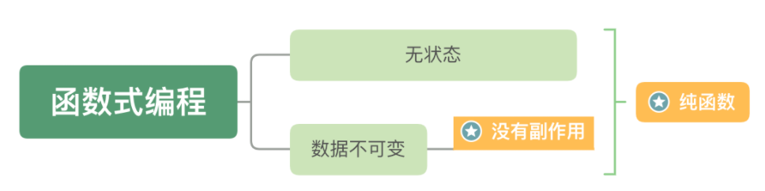

# JavaScript

## 1. 解释下什么是变量声明提升?

变量提升(hoisting)，是负责解析执行代码的 JavaScript 引擎的工作方式产生的一个特性。

JS引擎在运行一份代码的时候，会按照下面的步骤进行工作:

1.  首先，对代码进行预解析，并获取声明的所有变量
2. 然后，将这些变量的声明语句统一放到代码的最前面
3. 最后，开始一行一行运行代码

我们通过一段代码来解释这个运行过程:

```js
console.log(a)
var a = 1
function b() {
  console.log(a)
}
b() // 1
```

上面这段代码的实际执行顺序为:

1.  JS引擎将 `var a = 1` 分解为两个部分:
   1. 变量声明语句 `var a = undefined` 
   2. 变量赋值语句 `a = 1`
2.  JS引擎将 `var a = undefined` 放到代码的最前面，而 `a = 1` 保留在原地

也就是说经过了转换，代码就变成了:

```js
var a = undefined 
console.log(a) // undefined 
a=1
function b() {
  console.log(a)
}
b() // 1
```

变量的这一转换过程，就被称为变量的声明提升。

**注意：** 这种代码在 `ES6` 之后被认为是 **不规范, 不合理的。** 

我们可以使用 `let` ，避免变量提升的问题出现。


## 2. JS 的参数是以什么方式进行传递的?

基本数据类型和复杂数据类型的数据在传递时，会有不同的表现。

### 基本类型：是值传递

```js
let a = 1
function test(x) {
  // 并不会改变实参的值 console.log(x)
	x = 10 
}
test(a) // 10
console.log(a) // 1
```

### 复杂类型：传递的是地址! (变量中存的就是地址)

```js
let a = {
  count: 1
}
function test(x) {
  x.count = 10
  console.log(x)
}
test(a) // { count: 10 }
console.log(a) // { count: 10 }
```

从运行结果来看，函数内改变了参数对象内的 count 后，外部的实参对象 a 的内容也跟着改变了，所以传递的是 地址。


## 3. 什么是内存泄漏、内存溢出？

### 内存泄露

**内存泄露 memory leak**：是指程序在申请内存后，无法释放已申请的内存空间，一次内存泄露危害可以忽略，但内存泄露堆积后果很严重，无论多少内存,迟早会被占光。


### 内存溢出

**内存溢出 out of memory**：是指程序在申请内存时，没有足够的内存空间供其使用，出现 `out of memory`；

比如申请了一个`integer`,但给它存了 `long` 才能存下的数，那就是内存溢出。


## 4.  JavaScript 垃圾回收是怎么做的?

JS中内存的分配和回收都是自动完成的，内存在不使用的时候会被垃圾回收器自动回收。

正因为垃圾回收器的存在，许多人认为JS不用太关心内存管理的问题，但如果不了解JS的内存管理机制，我们同样非常容易成内存泄漏(内存无法被回收)的情况。

所以当面试官提问道 `JavaScript 垃圾回收`，我们可以从以下两个方面进行详细的解释：

1. 内存的生命周期
2. 垃圾回收算法说明
   1. 引用计数法
   2. 标记清除法

### 内存的生命周期

JS环境中分配的内存, 一般有如下生命周期：

1. 内存分配：当我们声明变量、函数、对象的时候，系统会自动为他们分配内存
2. 内存使用：即读写内存，也就是使用变量、函数等
3. 内存回收：使用完毕，由垃圾回收自动回收不再使用的内存。（全局变量一般不会回收, 一般局部变量的的值, 不用了, 会被自动回收掉）

### 垃圾回收算法说明

所谓垃圾回收, 核心思想就是：如何判断内存是否已经不再会被使用了, 如果是, 就视为垃圾, 释放掉。

在当前浏览器中，垃圾回收算法主要有两种：

1. 引用计数法（`IE` 常用，目前 `IE` 逐步退出舞台）
2. 标记清除法（大多数浏览器使用）

#### 引用计数法

IE采用的引用计数算法, 定义**“内存不再使用”**的标准很简单，就是看一个对象是否有指向它的引用。

如果没有任何变量指向它了，说明该对象已经不再需要了。

```js
// 创建一个对象person, person指向一块内存空间, 该内存空间的引用数 +1 
let person = {
	age: 22,
  name: 'ifcode'
}
// 两个变量指向一块内存空间, 该内存空间的引用数为 2
let p = person
// 原来的 person 对象被赋值为1，对象内存空间的引用数-1,
// 但因为p指向原person对象，还剩一个对于对象空间的引用, 所以对象它不会被回收
person = 1
// 原person对象已经没有引用，会被回收
p = null
```

由上面可以看出，引用计数算法是个简单有效的算法。

**但它却存在一个致命的问题：循环引用。**

如果两个对象相互引用，尽管他们已不再使用，垃圾回收器不会进行回收，导致内存泄露。

```js
function cycle() {
  let o1 = {}
  let o2 = {}
  // o1 中访问 o2
  o1.a = o2
  // o2 中访问 o1
  o2.a = o1
  // 则此时，o1 和 o2 互相引用，即：计数均为 1。
  // 但是又因为 o1 和 o2 均为局部变量， 会存在内存泄漏
} 
cycle()
```

### 标记清除算法

因为以上原因，现代的浏览器已经不再使用引用计数算法了。

现代浏览器通用的大多是基于 **标记清除算法** 的某些改进算法，总体思想都是一致的。

标记清除法：

1. 标记清除算法将“不再使用的对象”定义为“无法达到的对象”。 
2. 简单来说，就是从根部(在JS中就是全局对象)出发定时扫描内存中的对象。 
3. 凡是能从根部到达的对象，都是还需要使用的。那些无法由根部出发触及到的对象被标记为不再使用，稍后进行回收。

具体可参考：[MDN 内存管理](https://developer.mozilla.org/zh-CN/docs/Web/JavaScript/Memory_Management#%E7%AE%80%E4%BB%8B)


## 5. 谈谈你对闭包的理解？

闭包概念是面试中非常常见的一个问题，几乎可以理解为 “必答题”。

### 闭包的概念

闭包是一个 **函数**，它的概念为：**可以访问上层函数作用域中变量的函数，就是闭包函数**。

### 闭包的主要作用

在实际开发中，闭包最大的作用就是用来 **变量私有**。

查看以下例子：

```js
function fn () {
  let count = 0

  function add () {
    count++
    console.log('fn函数被调用了' + count + '次')
  }

  return add
}
const addFn = fn()
addFn()
addFn()
addFn()
```

`count` 为局部变量，不会被外部修改


## 6.  JavaScript原型，原型链 ? 有什么特点？

大图镇楼：


要讲清楚这个问题，主要着重这几个方面：

- 什么是原型对象
- 构造函数, 原型对象, 实例的三角关系图
- 原型链如何形成


### 原型对象

在 JavaScript 中，除去一部分内建函数，绝大多数的函数都会包含有一个叫做 `prototype` 的属性，指向原型对象，

基于构造函数创建出来的实例, 都可以共享访问原型对象的属性。

例如我们的 `hasOwnProperty`, `toString` ⽅法等其实是 Obejct 原型对象的方法，它可以被任何对象当做⾃⼰的⽅法来使⽤。

`hasOwnProperty` 用于判断, 某个属性, 是不是自己的  (还是原型链上的)

```js
let person = { 
  name: "Tom", 
  age: 18, 
  job: "student"
}

console.log(person.hasOwnProperty("name")) // true 
console.log(person.hasOwnProperty("hasOwnProperty")) // false 
console.log(Object.prototype.hasOwnProperty("hasOwnProperty")) // true
```

可以看到，`hasOwnProperty` 并不是 `person` 对象的属性，但是 `person` 却能调用它。

### 原型链

在 JavaScript 中，每个对象中都有一个 `__proto__` 属性，这个属性指向了当前对象的构造函数的原型。

对象可以通过自身的 `__proto__`属性与它的构造函数的原型对象连接起来，

而因为它的原型对象也有 `__proto__`，因此这样就串联形成一个链式结构，也就是我们称为的原型链。

**详情可查看：** [MDN 继承与原型链](https://developer.mozilla.org/zh-CN/docs/Web/JavaScript/Inheritance_and_the_prototype_chain)


## 7. Javascript如何实现继承？

继承（inheritance）是：面向对象软件技术当中的一个概念。可以使得子类具有父类别的各种属性和方法，而不需要再次编写相同的代码。

但是 `JavaScript` 并不是真正的面向对象语言，所以它的继承会更加复杂（相对于 `java` 而言），或者说 “更加灵活”

下面给出`JavaScripy`常见的继承方式：

- 原型链继承
- 构造函数继承（借助 call）
- 组合继承
- 原型式继承
- 寄生式继承
- 寄生组合式继承
- ES6 的 extends 继承

### 原型链继承

原型链继承是比较常见的继承方式之一，其中涉及的 **构造函数、原型和实例** 

三者之间存在着一定的关系，即：**每一个构造函数都有一个原型对象，原型对象又包含一个指向构造函数的指针，而实例则包含一个原型对象的指针**

举个例子：

```js
 function Parent() {
    this.name = 'parent1';
    this.play = [1, 2, 3]
  }
  function Child() {
    this.type = 'child2';
  }
  Child1.prototype = new Parent();
  console.log(new Child())
```

上面代码看似没问题，实际存在潜在问题：

```js
var s1 = new Child2();
var s2 = new Child2();
s1.play.push(4);
console.log(s1.play, s2.play); // [1,2,3,4]
```

改变`s1`的`play`属性，会发现`s2`也跟着发生变化了，这是因为两个实例使用的是同一个原型对象，内存空间是共享的。

### 构造函数继承

借助 `call`调用`Parent`函数

```js
function Parent(){
    this.name = 'parent1';
}

Parent.prototype.getName = function () {
    return this.name;
}

function Child(){
    Parent1.call(this);
    this.type = 'child'
}

let child = new Child();
console.log(child);  // 没问题
console.log(child.getName());  // 会报错
```

可以看到，父类原型对象中一旦存在父类之前自己定义的方法，那么子类将无法继承这些方法

相比第一种原型链继承方式，父类的引用属性不会被共享，优化了第一种继承方式的弊端，但是只能继承父类的实例属性和方法，不能继承原型属性或者方法。

### 组合继承

前面我们讲到两种继承方式，各有优缺点。组合继承则将前两种方式继承起来：

```js
function Parent3 () {
    this.name = 'parent3';
    this.play = [1, 2, 3];
}

Parent3.prototype.getName = function () {
    return this.name;
}
function Child3() {
    // 第二次调用 Parent3()
    Parent3.call(this);
    this.type = 'child3';
}

// 第一次调用 Parent3()
Child3.prototype = new Parent3();
// 手动挂上构造器，指向自己的构造函数
Child3.prototype.constructor = Child3;
var s3 = new Child3();
var s4 = new Child3();
s3.play.push(4);
console.log(s3.play, s4.play);  // 不互相影响
console.log(s3.getName()); // 正常输出'parent3'
console.log(s4.getName()); // 正常输出'parent3'
```

这种方式看起来就没什么问题，方式一和方式二的问题都解决了，但是从上面代码我们也可以看到`Parent3` 执行了**两次**，造成了多构造一次的性能开销

### 原型式继承

这里主要借助`Object.create`方法实现普通对象的继承：

```js
let parent4 = {
    name: "parent4",
    friends: ["p1", "p2", "p3"],
    getName: function() {
      return this.name;
    }
  };

  let person4 = Object.create(parent4);
  person4.name = "tom";
  person4.friends.push("jerry");

  let person5 = Object.create(parent4);
  person5.friends.push("lucy");

  console.log(person4.name); // tom
  console.log(person4.name === person4.getName()); // true
  console.log(person5.name); // parent4
  console.log(person4.friends); // ["p1", "p2", "p3","jerry","lucy"]
  console.log(person5.friends); // ["p1", "p2", "p3","jerry","lucy"]
```

这种继承方式的缺点也很明显，因为`Object.create`方法实现的是浅拷贝，多个实例的引用类型属性指向相同的内存，存在篡改的可能

### 寄生式继承

寄生式继承在上面继承基础上进行优化，利用这个浅拷贝的能力再进行增强，添加一些方法：

```js
let parent5 = {
    name: "parent5",
    friends: ["p1", "p2", "p3"],
    getName: function() {
        return this.name;
    }
};

function clone(original) {
    let clone = Object.create(original);
    clone.getFriends = function() {
        return this.friends;
    };
    return clone;
}

let person5 = clone(parent5);

console.log(person5.getName()); // parent5
console.log(person5.getFriends()); // ["p1", "p2", "p3"]
```

其优缺点也很明显，跟上面讲的原型式继承一样

###  寄生组合式继承

寄生组合式继承，借助解决普通对象的继承问题的`Object.create` 方法，在前面几种继承方式的优缺点基础上进行改造，这也是所有继承方式里面相对最优的继承方式：

```js
function clone (parent, child) {
    // 这里改用 Object.create 就可以减少组合继承中多进行一次构造的过程
    child.prototype = Object.create(parent.prototype);
    child.prototype.constructor = child;
}

function Parent6() {
    this.name = 'parent6';
    this.play = [1, 2, 3];
}
Parent6.prototype.getName = function () {
    return this.name;
}
function Child6() {
    Parent6.call(this);
    this.friends = 'child5';
}

clone(Parent6, Child6);

Child6.prototype.getFriends = function () {
    return this.friends;
}

let person6 = new Child6();
console.log(person6); //{friends:"child5",name:"child5",play:[1,2,3],__proto__:Parent6}
console.log(person6.getName()); // parent6
console.log(person6.getFriends()); // child5
```

可以看到 person6 打印出来的结果，属性都得到了继承，方法也没问题

### ES6 的 extends 继承

[extends](https://developer.mozilla.org/zh-CN/docs/Web/JavaScript/Reference/Classes/extends) 关键字是 `ES6` 新增的用于实现继承的方式：

```js
class Person {
  constructor(name) {
    this.name = name
  }
  // 原型方法
  // 即 Person.prototype.getName = function() { }
  // 下面可以简写为 getName() {...}
  getName = function () {
    console.log('Person:', this.name)
  }
}
class Gamer extends Person {
  constructor(name, age) {
    // 子类中存在构造函数，则需要在使用“this”之前首先调用 super()。
    super(name)
    this.age = age
  }
}
const asuna = new Gamer('Asuna', 20)
asuna.getName() // 成功访问到父类的方法
```

这种方式如果我们使用 `Babel` 进行了转化之后，可以发现 `extends`实际采用的也是 **寄生组合继承方式**，因此也证明了这种方式是较优的解决继承的方式

### 总结：

通过以下图进行总结：


## 8. 如何判断是否是数组？

方法一：使用 `toString` 方法

```js
function isArray(arg) {
	return Object.prototype.toString.call(arg) === '[object Array]'
}

let arr = [1,2,3]
isArray(arr)  // true
```

方法二：使用 ES6 新增的 `Array.isArray` 方法

```js
let arr = [1,2,3]
Array.isArray(arr) // true
```


## 9. 谈谈你对this的理解？

函数的 `this` 关键字在 `JavaScript` 中的表现略有不同，此外，在严格模式和非严格模式之间也会有一些差别

### 运行时绑定（普通函数）

在绝大多数情况下，函数的调用方式决定了 `this` 的值（运行时绑定）。

`this` 关键字是函数运行时自动生成的一个内部对象，只能在函数内部使用，总指向调用它的对象：

```js
function baz() {
    // 当前调用栈是：baz
    // 因此，当前调用位置是全局作用域
    
    console.log( "baz" );
    bar(); // <-- bar的调用位置
}

function bar() {
    // 当前调用栈是：baz --> bar
    // 因此，当前调用位置在baz中
    
    console.log( "bar" );
    foo(); // <-- foo的调用位置
}

function foo() {
    // 当前调用栈是：baz --> bar --> foo
    // 因此，当前调用位置在bar中
    
    console.log( "foo" );
}

baz(); // <-- baz的调用位置
```

同时，`this`在函数执行过程中，`this`一旦被确定了，就不可以再更改：

```js
var a = 10;
var obj = {
  a: 20
}

function fn() {
  this = obj; // 修改this，运行后会报错
  console.log(this.a);
}

fn();
```

### 箭头函数

箭头函数不同于传统函数，它其实没有属于⾃⼰的 `this`，

它所谓的 `this` 是, 捕获其外层  上下⽂的 `this` 值作为⾃⼰的 `this` 值。

并且由于箭头函数没有属于⾃⼰的 `this` ，它是不能被 `new` 调⽤的。

我们可以通过 Babel 转换前后的代码来更清晰的理解箭头函数：

```js
// 转换前的 ES6 代码
const obj = { 
  test() { 
    return () => { 
      console.log(this === obj)
    }
  } 
}

// 转换后的 ES5 代码
var obj = { 
  test: function getArrow() { 
    var that = this
    return function () { 
      console.log(that === obj)
    }
  } 
}
```

这里我们看到，箭头函数中的 `this` 就是它上层上下文函数中的 `this`。

### 绑定规则

关于绑定规则多数情况下在面试的时候 **不会** 问的这么详细，所以作为了解即可：

根据不同的使用场合，`this`有不同的值，主要分为下面几种情况：

- 默认绑定
- 隐式绑定
- new绑定
- 显示绑定

####  默认绑定

全局环境中定义`person`函数，内部使用`this`关键字：

```js
var name = 'Jenny';
function person() {
    return this.name;
}
console.log(person());  //Jenny
```

上述代码输出`Jenny`，原因是调用函数的对象在游览器中位`window`，因此`this`指向`window`，所以输出`Jenny`

**注意：**

严格模式下，不能将全局对象用于默认绑定，this会绑定到`undefined`，只有函数运行在非严格模式下，默认绑定才能绑定到全局对象

#### 隐式绑定

函数还可以作为某个对象的方法调用，这时`this`就指这个上级对象

```js
function test() {
  console.log(this.x);
}

var obj = {};
obj.x = 1;
obj.m = test;

obj.m(); // 1
```

这个函数中包含多个对象，尽管这个函数是被最外层的对象所调用，`this`指向的也只是它上一级的对象


#### new绑定

通过构建函数`new`关键字生成一个实例对象，此时`this`指向这个实例对象

```js
function test() {
　this.x = 1;
}

var obj = new test();
obj.x // 1
```

上述代码之所以能过输出1，是因为`new`关键字改变了`this`的指向

#### 显示修改

`apply()、call()、bind()`是函数的一个方法，作用是改变函数的调用对象。它的第一个参数就表示改变后的调用这个函数的对象。因此，这时`this`指的就是这第一个参数

```js
var x = 0;
function test() {
　console.log(this.x);
}

var obj = {};
obj.x = 1;
obj.m = test;
obj.m.apply(obj) // 1
```

关于`apply、call、bind`三者的区别，我们后面再详细说


## 10. 连环问：bind、call、apply 区别？

### 相同点：

`call`、`apply`、`bind`作用是改变函数执行时的上下文，简而言之就是改变函数运行时的`this`指向

### 不同点：

#### apply：

`apply`接受两个参数，第一个参数是`this`的指向，第二个参数是函数接受的参数，以数组的形式传入

改变`this`指向后原函数会立即执行，且此方法只是临时改变`this`指向一次

```js
function fn(...args){
    console.log(this,args);
}
let obj = {
    myname:"张三"
}

fn.apply(obj,[1,2]); // this会变成传入的obj，传入的参数必须是一个数组；
fn(1,2) // this指向window
```

当第一个参数为`null`、`undefined`的时候，默认指向`window`(在浏览器中)：

```js
fn.apply(null,[1,2]); // this指向window
fn.apply(undefined,[1,2]); // this指向window
```

#### call

`call`方法的第一个参数也是`this`的指向，后面传入的是一个参数列表

跟`apply`一样，改变`this`指向后原函数会立即执行，且此方法只是临时改变`this`指向一次

```js
function fn(...args){
    console.log(this,args);
}
let obj = {
    myname:"张三"
}

fn.call(obj,1,2); // this会变成传入的obj，传入的参数必须是一个数组；
fn(1,2) // this指向window
```

同样的，当第一个参数为`null`、`undefined`的时候，默认指向`window`(在浏览器中)

#### bind

bind方法和call很相似，第一参数也是`this`的指向，后面传入的也是一个参数列表(但是这个参数列表可以分多次传入)

改变`this`指向后不会立即执行，而是返回一个永久改变`this`指向的函数

```js
function fn(...args){
    console.log(this,args);
}
let obj = {
    myname:"张三"
}

const bindFn = fn.bind(obj); // this 也会变成传入的obj ，bind不是立即执行需要执行一次
bindFn(1,2) // this指向obj
fn(1,2) // this指向window
```


## 11. 连环问：如何实现一个bind?

该问题属于连环问中的一个比较深入的知识点。

实现`bind`的步骤，我们可以分解成为三部分：

- 修改`this`指向

- 动态传递参数

  ```js
  // 方式一：只在bind中传递函数参数
  fn.bind(obj,1,2)()
  
  // 方式二：在bind中传递函数参数，也在返回函数中传递参数
  fn.bind(obj,1)(2)
  ```

- 兼容`new`关键字

整体实现代码如下：

```js
// 利用原型链为 Function 创建原型方法
Function.prototype.myBind = function (context) {
    // 判断调用对象是否为函数
    if (typeof this !== "function") {
        throw new TypeError("Error");
    }

    // 获取参数
    const args = [...arguments].slice(1),
          fn = this;

    return function Fn() {

        // 根据调用方式，传入不同绑定值
        return fn.apply(this instanceof Fn ? new fn(...arguments) : context, args.concat(...arguments)); 
    }
}
```


## 12. 说说你对事件循环（EventLoop）的理解

事件循环是一个在 **异步** 中非常容易被问到的知识点，基于事件循环，可能还会产生如下连环问：

1. `promise`
2. `async` 和 `await`
3. 宏任务、微任务

针对一系列问题，我们先看 `EventLoop`

### 是什么

首先，`JavaScript`是一门单线程的语言，意味着同一时间内只能做一件事，但是这并不意味着单线程就是阻塞，而实现单线程非阻塞的方法就是事件循环。

在`JavaScript`中，所有的任务都可以分为：

- 同步任务：立即执行的任务，同步任务一般会直接进入到主线程中执行
- 异步任务：异步执行的任务，比如`ajax`网络请求，`setTimeout`定时函数等

同步任务与异步任务的运行流程图如下：


## 13. 连环问：Promise 的作用是什么

`Promise`，译为承诺，是异步编程的一种解决方案，比传统的解决方案（回调函数）更加合理和更加强大

在以往我们如果处理多层异步操作，我们往往会像下面那样编写我们的代码：

```js
doSomething(function(result) {
  doSomethingElse(result, function(newResult) {
    doThirdThing(newResult, function(finalResult) {
      console.log('得到最终结果: ' + finalResult);
    }, failureCallback);
  }, failureCallback);
}, failureCallback);
```

阅读上面代码，是不是很难受，上述形成了经典的 **回调地狱**

而 `promise` 的出现就是：**为了解决 回调地狱 的问题**

现在通过`Promise`的改写上面的代码：

```js
doSomething().then(function(result) {
  return doSomethingElse(result);
})
.then(function(newResult) {
  return doThirdThing(newResult);
})
.then(function(finalResult) {
  console.log('得到最终结果: ' + finalResult);
})
.catch(failureCallback);
```

瞬间感受到`promise`解决异步操作的优点：

- 链式操作减低了编码难度
- 代码可读性明显增强

接下来我们分别从：

- 状态
- 特点
- 流程

这三个方面来说一下 `promise`

### 状态

一个 `Promise` 必然处于以下几种状态之一：

- *待定（`pending`）*：初始状态，既没有被兑现，也没有被拒绝。
- *已兑现（`fulfilled`）*：意味着操作成功完成。
- *已拒绝（`rejected`）*：意味着操作失败。

### 特点

- 对象的状态不受外界影响，只有异步操作的结果，可以决定当前是哪一种状态
- 一旦状态改变（从`pending`变为`fulfilled`和从`pending`变为`rejected`），就不会再变，任何时候都可以得到这个结果

### 流程

认真阅读下图，我们能够轻松了解`promise`整个流程：


## 14：连环问：那么 Promise 还提供了什么静态方法？

`Promise` 提供的静态方法有很多，主要常用的有：

- [all](https://developer.mozilla.org/zh-CN/docs/Web/JavaScript/Reference/Global_Objects/Promise/all)
- [race](https://developer.mozilla.org/zh-CN/docs/Web/JavaScript/Reference/Global_Objects/Promise/race)
- [reject](https://developer.mozilla.org/zh-CN/docs/Web/JavaScript/Reference/Global_Objects/Promise/reject)

### all

`Promise.all([promise1, promise2, promise3])`  等待原则, 是在所有promise都完成后执行, 可以用于处理一些`并发的任务`：

```js
// 后面的.then中配置的函数, 是在前面的所有promise都完成后执行, 可以用于处理一些并发的任务
Promise.all([promise1, promise2, promise3]).then((values) => {
  // values 是一个数组, 会收集前面promise的结果 values[0] => promise1的成功的结果
})
```

### race

`Promise.race([promise1, promise2, promise3])` 赛跑, 竞速原则, 只要三个`promise`中有一个满足条件, 就会执行`.then` 

### reject

`Promise.reject(reason)`方法也会返回一个新的 `Promise` 实例，该实例的状态为`rejected`：

```js
const p = Promise.reject('出错了');
// 等同于
const p = new Promise((resolve, reject) => reject('出错了'))

p.then(null, function (s) {
  console.log(s)
});
// 出错了
```

`reject` 多用于在 **axios 的响应拦截器** 中，针对服务端返回数据进行统一处理时的错误处理，例如：

```js
// 响应拦截器
service.interceptors.response.use(
  (response) => {
    const { success } = response.data
    //   根据success的成功与否决定下面的操作
    if (success) {
      return data
    } else {
      // 业务错误
      return Promise.reject(new Error(message))
    }
  },
  (error) => {
    // 错误处理
    return Promise.reject(error)
  }
)
```


## 15：连环问：async/await 的作用是什么？

ES7 标准中新增的 `async` 函数，从目前的内部实现来说其实就是 [Generator](https://developer.mozilla.org/zh-CN/docs/Web/JavaScript/Reference/Global_Objects/Generator) 函数的语法糖。

它基于 Promise，并与所有现存的基于Promise 的 API 兼容。 

**async 关键字**

1. `async` 关键字用于声明⼀个异步函数（如 `async function asyncTask1() {...}`） 

2. `async` 会⾃动将常规函数转换成 Promise，返回值也是⼀个 Promise 对象 

3. `async` 函数内部可以使⽤ `await` 

**await 关键字**

1. `await` 用于等待异步的功能执⾏完毕 `var result = await someAsyncCall()` 
2. `await` 放置在 Promise 调⽤之前，会强制async函数中其他代码等待，直到 Promise 完成并返回结果 
3. `await` 只能与 Promise ⼀起使⽤
4. `await` 只能在 `async` 函数内部使⽤ 

## 16：连环问：相较于 Promise，async/await有何优势？

1. 同步化代码的阅读体验（Promise 虽然摆脱了回调地狱，但 then 链式调⽤的阅读负担还是存在的）
2. 和同步代码更一致的错误处理方式（ async/await 可以⽤成熟的 try/catch 做处理，比 Promise 的错误捕获更简洁直观） 
3. 调试时的阅读性, 也相对更友好

## 17：连环问：任务队列中分为：宏任务 微任务 ，它们分别是什么

### 前置说法：

1. js是单线程的，但是分同步异步
2. 微任务和宏任务皆为异步任务，它们都属于一个队列
3. 宏任务一般是：script、setTimeout、setInterval、postMessage、MessageChannel、setImmediate(Node.js 环境)
4. 微任务：Promise.then、Object.observe、MutationObserver、process.nextTick(Node.js 环境)
5. 先执行同步再执行异步，异步遇到微任务，先执行微任务，执行完后如果没有微任务，就执行下一个宏任务，如果有微任务，就按顺序一个一个执行微任务

### 宏任务、微任务是怎么执行的？

**执行顺序：**

- 先执行同步代码
- 遇到异步宏任务则将异步宏任务放入宏任务队列中，遇到异步微任务则将异步微任务放入微任务队列中
- 当所有同步代码执行完毕后，再将异步微任务从队列中调入主线程执行，微任务执行完毕后再将异步宏任务从队列中调入主线程执行，一直循环直至所有任务执行完毕。

这里容易产生一个**错误的**认识：就是微任务先于宏任务执行。实际上是 **先执行同步任务然后在执行异步任务，异步任务是分宏任务和微任务两种，异步遇到微任务先执行微任务，执行完后如果没有微任务，就执行下一个宏任务**。

## 18. Javascript本地存储的方式有哪些？


1. Cookies
2. localStorage 
3. sessionStorage 
4. Web SQL
5. IndexedDB


## 19. 连环问：以上几种前端存储的区别是什么?

| 方式名称       | 标准说明      | 功能说明                                                     |
| -------------- | ------------- | ------------------------------------------------------------ |
| Cookies        | HTML5 前 加入 | 1.会为每个请求自动携带所有的Cookies数据，比较方便，但是也是缺点，浪费流量;  <br />2.每个domain(站点)限制存储20个cookie;  <br />3.容量只有4K<br />4.浏览器API比较原始，需要自行封装操作。 (js-cookie) |
| localStorage   | HTML5 加 入   | 1.兼容IE8+，操作方便;<br />2.永久存储，除非手动删除;<br />3.容量为5M |
| sessionStorage | HTML5 加 入   | 1.功能基本与 localStorage 相似，但当前页面关闭后即被自动清理;<br />2.与Cookies、localStorage 不同点是不能在所有同源窗口间共享，属于会 话级别的存储 |
| Web SQL        | 非标准功能    | 1.2010年已被废弃，但一些主流浏览器中都有相关的实现;<br />2.类似于 SQLite 数据库，是一种真正意义上的关系型数据库，用SQL进行 操作; |
| IndexedDB      | HTML5 加 入   | 1.是一种 NoSQL 数据库，用键值对进行储存，可进行快速读取操作;<br />2.适合复杂 Web存储场景，用JS操作方便 (前端大量存数据的场景较少, 如 果有, 可以用)<br />3.存储空间容量, 大于等于 250MB，甚至没有上限 |


## 20. 回流和重绘的区别是什么？

**重排**: 也叫做回流，当DOM元素影响了元素的几何属性（例如宽和高），浏览器需要重新计算元素的几何属性，同样其它元素的几何属性也会和位置也会因此受到影响。浏览器会使渲染树中受到影响的部分失效，并重新构造渲染树。这个过程称为“重排”。

**重绘**: 完成重排后，浏览器会重新绘制受影响的部分到屏幕上中，该过程称为“重绘”。
**总结：**

当我们改变DOM的大小，增加删除都会导致重排，当给DOM元素改变颜色的时候，会导致重绘，重排一定会重绘，重绘不会重排。

**重排会影响性能，所以我们尽快能的减少重排的操作**


## 21. 说说你对函数式编程的理解？优缺点？

### 是什么

函数式编程是一种"编程范式"（programming paradigm），一种编写程序的方法论

主要的编程范式有三种：命令式编程，声明式编程和函数式编程

相比命令式编程，函数式编程更加强调程序执行的结果而非执行的过程，倡导利用若干简单的执行单元让计算结果不断渐进，逐层推导复杂的运算，而非设计一个复杂的执行过程

举个例子，将数组每个元素进行平方操作，命令式编程与函数式编程如下：

```js
// 命令式编程
var array = [0, 1, 2, 3]
for(let i = 0; i < array.length; i++) {
    array[i] = Math.pow(array[i], 2)
}

// 函数式方式
[0, 1, 2, 3].map(num => Math.pow(num, 2))
```

简单来讲，就是要把过程逻辑写成函数，定义好输入参数，只关心它的输出结果。

## 22. 连环问：能说一下 纯函数、高阶函数、柯里化 的区别吗？

###  纯函数

函数式编程旨在尽可能的提高代码的**无状态性和不变性**。

要做到这一点，就要学会使用无副作用的函数，也就是纯函数

纯函数是对给定的输入返还相同输出的函数，并且要求你所有的数据都是不可变的，即：**纯函数=无状态+数据不可变**



举一个简单的例子：

```js
let double = value => value * 2;
```

#### 特性：

- 函数内部传入指定的值，就会返回确定唯一的值
- 不会造成超出作用域的变化，例如修改全局变量或引用传递的参数

#### 优势：

- 使用纯函数，我们可以产生可测试的代码

  ```js
  test('double(2) 等于 4', () => {
    expect(double(2)).toBe(4);
  })
  ```

- 不依赖外部环境计算，不会产生副作用，提高函数的复用性

- 可读性更强 ，函数不管是否是纯函数 都会有一个语义化的名称，更便于阅读

- 可以组装成复杂任务的可能性。符合模块化概念及单一职责原则

### 高阶函数

**高阶函数** 指的是：可以接收函数作为参数，同时也可以返回一个新的函数。

**高阶函数**之所以*高阶*，是因为：高阶函数的参数和返回值对象可以是函数，这超越了普通函数处理的数据类型，例如字符串（strings）、数字（numbers）、布尔值（booleans）等。

理解高阶函数的关键在于，**函数即数据**。

通过高阶函数抽象过程，注重结果，如下面例子：

```js
const forEach = function(arr,fn){
    for(let i=0;i<arr.length;i++){
        fn(arr[i]);
    }
}
let arr = [1,2,3];
forEach(arr,(item)=>{
    console.log(item);
})
```

上面通过高阶函数 `forEach`来抽象循环如何做的逻辑，直接关注做了什么

高阶函数存在 **缓存** 的特性，主要是利用闭包作用：

```js
const once = (fn)=>{
    let done = false;
    return function(){
        if(!done){
            fn.apply(this,fn);
        }else{
            console.log("该函数已经执行");
        }
        done = true;
    }
}
```

### 柯里化

柯里化（Currying），又称部分求值（Partial Evaluation），是：**把接受多个参数的函数变换成接受一个单一参数（最初函数的第一个参数）的函数，并且返回接受余下的参数而且返回结果的新函数的技术。**

可以简单理解为：柯里化是 **把一个多参数函数转化成一个嵌套的一元函数（一个参数）的过程**。

一个二元函数如下：

```js
let fn = (x,y) => x + y ;
```

转化成柯里化函数如下：

```js
const curry = function(fn){
    return function(x){
        return function(y){
            return fn(x,y);
        }
    }
}
let myfn = curry(fn);
console.log( myfn(1)(2) );
```

关于柯里化函数的意义如下：

- 让纯函数更纯，每次接受一个参数，松散解耦
- 惰性执行

## 23：什么是防抖和节流？有什么区别？如何实现？

防抖和节流，本质上是 **优化高频率执行代码** 的一种手段

- 防抖: n 秒后在执行该事件，若在 n 秒内被重复触发，则重新计时
- 节流: n 秒内只运行一次，若在 n 秒内重复触发，只有一次生效

### 防抖：

通过以下案例，很好地解释了防抖：

```html
<body>
  <input type="text" placeholder="请在此输入内容，从而触发搜索">
</body>

<script>
  // 需求：有一个输入框，用户通过这个输入框输入文字，进行搜索
  // 当我想要搜索 mac 的时候，只需要触发一次 mac 的搜索行为
  // 所以我们期望：当我想搜索一个内容时，它只会搜索我们想要的文本
  // 那么想要达到这个想过，我们做的就是《防抖优化》
  // 防抖优化：在触发事件之后，在 n 秒内事件只执行一次。如果 n 秒内又再次触发了事件，则重新计时。
  // 举例：
  // 比如用户触发了一次搜索，那么不立刻执行搜索事件，而是延迟 500 ms 之后在进行。假如在这 500ms 之内，用户又一次触发了搜索事件，则 500 ms 重新计时。
  
	// 防抖函数
  // t = 500：参数默认值
  function debounce(fn, t = 500) {
    // 定义一个 setTimeout 实例，默认为 null
    let timeId = null
		// 返回一个闭包函数
    return function () {
      // timeId 存在，证明上一次的事件还未执行，则执行清理操作
      if (timeId) {
        clearTimeout(timeId)
      }
			// 重新计时
      timeId = setTimeout(() => {
        // console.log('触发了搜索');
        fn()
      }, t);
    }
  }

  const resultFn = debounce(() => {
    console.log('触发了搜索');
  }, 500)

  document.querySelector('input').addEventListener('input', resultFn)
</script>
```

### 节流： 

案例：实现一个功能，在鼠标移动的时候，让小图片跟着鼠标移动

```html
<body>
  <div>0</div>
  
</body>

<script>
  // 节流（节省流量）策略：规定一个时间差，在指定的时间差之内，只触发一次效果。触发的频率。
  // 1. 定义一个函数： throttle，该函数内部，返回另外一个函数
  // 2. throttle 接收两个参数：
  // 参数一：需要触发的函数
  // 参数二：时间差。这个时间差规定了多长时间触发一个 fn 函数
  // 3. 我们需要记录两个时间：
  // 3.1 第一个时间：上一次执行 fn 时的时间戳
  // 3.2 第二个时间：当前的时间戳
  // 3.3 如果 (当前的时间戳 - 上一次执行的时间戳) > t(时间差) 那是不是就代表了 fn 该执行了？
  // 4. 在执行完 fn 之后，我们需要更新《上一次执行的时间戳》
  function throttle(fn, t = 500) {
    // 上一次执行 fn 时的时间戳
    let prevTime = 0
    // e: addEventListener 的时候，接收到的 event 对象
    return function (e) {
      // 当前的时间戳
      const nowTime = Date.now()
      // 如果 (当前的时间戳 - 上一次执行的时间戳) > t(时间差) 那是不是就代表了 fn 该执行了？
      if ((nowTime - prevTime) > t) {
        // e：是闭包函数形参
        fn(e)
        // 在执行完 fn 之后，我们需要更新《上一次执行的时间戳》
        prevTime = nowTime
      }
    }
  }

  const resultFn = throttle((e) => {
    // 获取鼠标的位置，可以通过  e.pageX 和 e.pageY
    // console.log(e.pageX, e.pageY);
    imgEle.style.top = e.pageY + 'px'
    imgEle.style.left = e.pageX + 'px'
  }, 10)

  const imgEle = document.querySelector('img')
  document.body.addEventListener('mousemove', resultFn)
</script>
```

